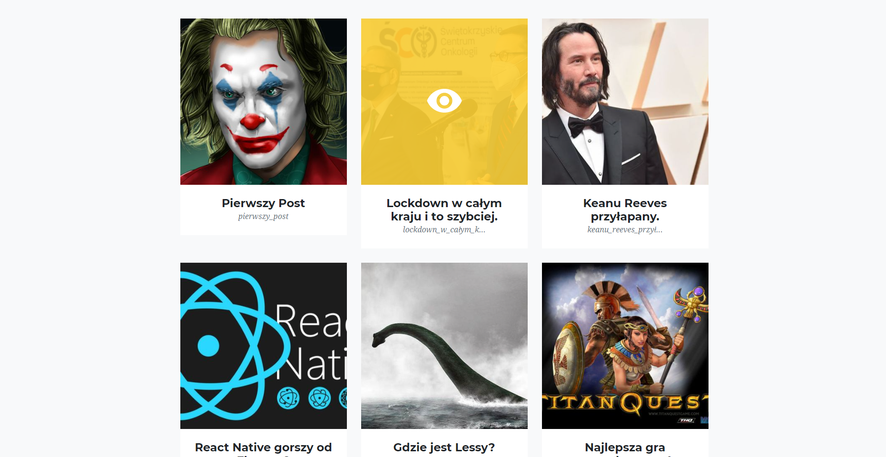
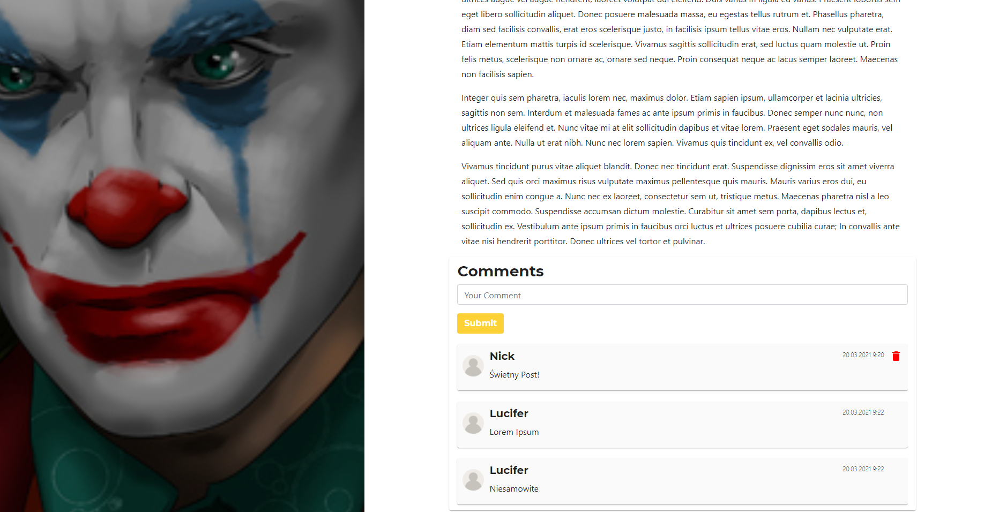
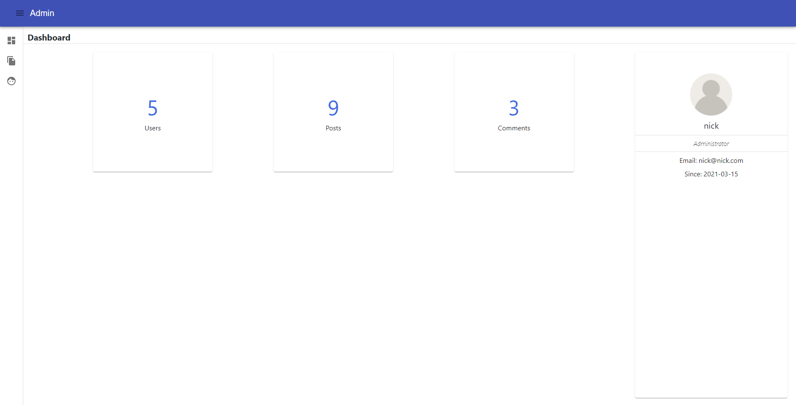
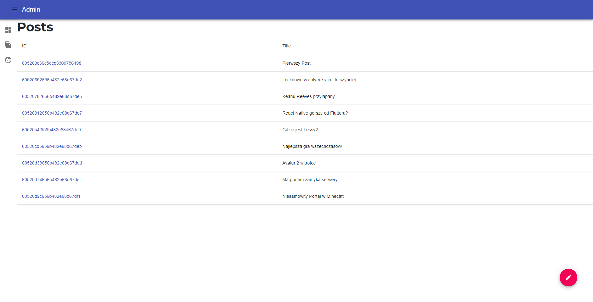
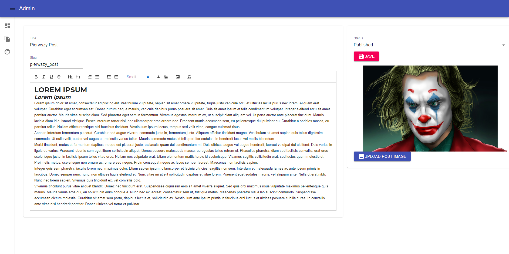
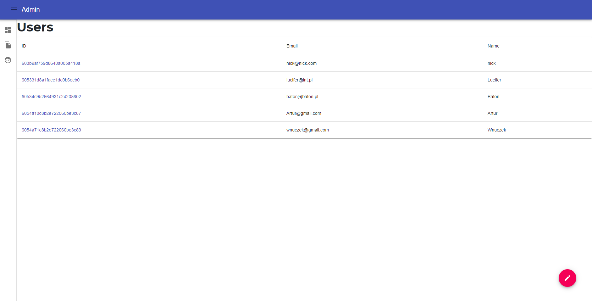
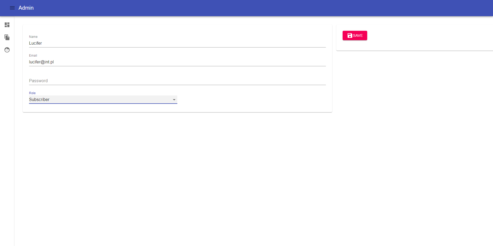

# Blog

A project created as part of learning Full-Stack Javascript in practice.  
Technologies/Tools used in the project:
- React
- Redux
- Loopback.js
- Mongodb
- Heroku

Live version of website: [Click here!](https://lucifer-blog.herokuapp.com)
## Screenshots

Here are some Screenshots of blog page:

There is a Dashboard too, where only users with admin role have access:

## Credits

Anonymous User Icon: Made by [Becris](https://creativemarket.com/Becris) from flaticon.com

## Heroku

In my project, I kept the uploaded image files on the backend side. Unfortunately heroku server has to shut down every day for 6 hours, additionally after this time all graphic files kept on the server were deleted. For demonstration purposes I have implemented displaying the same graphic in every article.